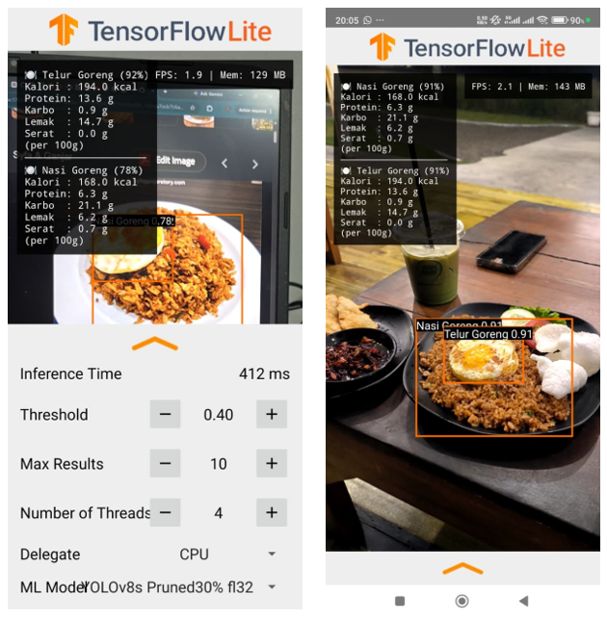

# YOLOv8 Structured Pruning for Mobile Food Detection

> Optimization of YOLOv8 Using Structured Pruning Based on Dependency Graph for Food Detection and Nutritional Information on Mobile Devices.

This repository contains the implementation of my bachelor's thesis, focusing on the optimization of the YOLOv8 object detection model using structured pruning based on a dependency graph. The optimized model is deployed on Android devices using TensorFlow Lite to perform food detection and provide nutritional information.

---

## 🚀 Project Highlights

- 📱 Successfully deployed on Android using TensorFlow Lite
- 🧠 YOLOv8s optimized using Structured Pruning based on a Dependency Graph
- 📦 **46.8% reduction** in TensorFlow Lite model size
- ⚡ Reduced memory usage compared to the original YOLOv8s model
- 🍽️ Food detection with nutritional information
- 📊 Trained and evaluated on a custom dataset containing **682 annotated images**
- 📱 On-device inference without requiring a server for model inference

---

## 📸 Mobile Application Demo

<p align="center">
  
  
</p>

The Android application performs food detection directly on the device and provides nutritional information based on the detected food category.

---

## ✨ Features

- Food detection using YOLOv8
- Structured pruning based on a Dependency Graph
- TensorFlow Lite model conversion and deployment
- On-device inference on Android
- Bounding box visualization with confidence scores
- Nutritional information for detected food
- Configurable confidence threshold
- Multi-thread inference support
- Lightweight model for mobile deployment

---

## 📊 Experimental Results

### Model Optimization

The following experiments were conducted using an NVIDIA Tesla T4 GPU.

| Model | Parameters | GFLOPs | Model Size (.pt) | Precision | Recall | F1-score | mAP@0.5 | mAP@0.5:0.95 | FPS |
|-------|-----------:|--------:|-----------------:|----------:|-------:|---------:|---------:|--------------:|----:|
| YOLOv8s | 11.13 M | 28.5 | 21.49 MB | 77.03% | 82.74% | 79.78% | 85.11% | 62.94% | 63.1 |
| YOLOv8s-Pruned20 | 7.54 M | 20.0 | 14.65 MB | 78.61% | 71.70% | 74.99% | 78.17% | 56.15% | 55.7 |
| **YOLOv8s-Pruned30** | **6.05 M** | **16.5** | **11.80 MB** | **70.94%** | **77.75%** | **74.19%** | **80.64%** | **58.04%** | **58.0** |
| YOLOv8s-Pruned50 | 3.60 M | 10.8 | 7.13 MB | 79.80% | 61.17% | 69.26% | 73.75% | 54.27% | 70.8 |

The **30% pruned model** was selected as the final deployment model because it provides a suitable trade-off between model complexity, detection performance, and mobile deployment efficiency.

Although the 50% pruned model achieves the highest GPU FPS, its detection performance decreases more significantly. The 30% pruned model therefore provides a more balanced configuration for the intended application.

---

### Android Deployment Performance

The final YOLOv8s-Pruned30 model was exported to TensorFlow Lite and evaluated on Android devices using different numbers of CPU threads.

| Model | Threads | Samples | Avg. Inference | Median Inference | Avg. FPS |
|-------|--------:|--------:|---------------:|-----------------:|---------:|
| YOLOv8s | 1 | 14 | 646.9 ms | 640.0 ms | 1.60 |
| YOLOv8s | 2 | 90 | 526.9 ms | 540.0 ms | 1.92 |
| YOLOv8s | 3 | 23 | 496.6 ms | 462.0 ms | 2.10 |
| YOLOv8s | 4 | 44 | 422.1 ms | 437.5 ms | 2.35 |
| **YOLOv8s-Pruned30** | **1** | **18** | **471.6 ms** | **500.5 ms** | **2.17** |
| **YOLOv8s-Pruned30** | **2** | **38** | **401.7 ms** | **412.5 ms** | **2.44** |
| **YOLOv8s-Pruned30** | **3** | **30** | **325.3 ms** | **318.5 ms** | **2.93** |
| **YOLOv8s-Pruned30** | **4** | **151** | **354.8 ms** | **334.0 ms** | **2.88** |

The pruned model achieved lower inference times across the tested thread configurations compared with the original YOLOv8s model.

---

### Android Resource Efficiency

| Aspect | YOLOv8s Baseline | YOLOv8s-Pruned30 | Improvement |
|--------|-----------------:|-----------------:|------------:|
| TensorFlow Lite Model Size | 43.64 MB | 23.21 MB | **46.8% reduction** |
| Native Heap – Xiaomi 13T | 179.3 MB | 119.3 MB | **33.5% lower** |
| Native Heap – Galaxy S24 Ultra | 165.5 MB | 104.8 MB | **36.7% lower** |
| Java Heap – Xiaomi 13T | 23.69 MB | 23.07 MB | **2.5% lower** |
| Java Heap – Galaxy S24 Ultra | 28.75 MB | 27.83 MB | **3.2% lower** |

The optimized model successfully reduced the deployed TensorFlow Lite model size and native memory usage compared with the original YOLOv8s model.

The Android implementation does not yet achieve the typical real-time target of approximately 20–30 FPS. However, the resulting inference performance is considered suitable for the intended informational and nutritional assistance use case, where continuous real-time video processing is not a strict requirement.

---

## 🛠️ Tech Stack

<p align="left">
  
  
  
  
  
  
  
  
</p>

---

## 📦 Environment

The main model training and evaluation experiments were performed using the following environment:

| Component | Version / Specification |
|-----------|--------------------------|
| Python | 3.12.13 |
| PyTorch | 2.11.0+cu128 |
| Ultralytics | 8.4.73 |
| CUDA | 12.8 |
| GPU | NVIDIA Tesla T4 |
| GPU Memory | 14,913 MiB |

The exact environment may vary depending on the notebook and execution platform.

---

## 📂 Project Structure

```text
skripsi-yolov8-food-pruning/
│
├── android/             # Android application
├── dataset/             # Dataset and dataset-related files
├── docs/
│   └── images/          # Images used in project documentation
├── model/               # Trained and exported models
├── notebooks/
│   ├── 01_yolov8_baseline_training.ipynb
│   └── 02_structured_pruning.ipynb
├── results/             # Training and evaluation results
├── README.md
└── LICENSE
```

---

## ⚙️ Getting Started

This repository is organized into two main components: **model development** and **Android deployment**.

### Model Development

The `notebooks/` directory contains the main model development workflow:

1. Train the YOLOv8s baseline model.
2. Evaluate the baseline model.
3. Apply structured pruning based on a Dependency Graph.
4. Evaluate different pruning ratios.
5. Export the selected model for mobile deployment.

The notebooks can be executed using Google Colab with a compatible GPU environment.

### Android Application

The `android/` directory contains the Android application source code.

The application uses the exported TensorFlow Lite model to perform on-device inference and display nutritional information for detected food objects.

Detailed Android setup and build instructions will be provided in the `android/` directory.

---

## 📚 Dataset

The model was trained and evaluated using a custom food detection dataset.

- **Total images:** 682
- **Annotations:** 1,239
- **Number of classes:** 18
- **Dataset platform:** Roboflow

The dataset contains 18 commonly found food categories intended for object detection and subsequent nutritional information retrieval.

---

## 🔬 Methodology
The overall optimization workflow consists of the following stages:
```text
Food Dataset
     │
     ▼
Data Annotation & Preprocessing
     │
     ▼
YOLOv8s Baseline Training
     │
     ▼
Baseline Evaluation
     │
     ▼
C2f → C2f_v2 Architecture Modification
     │
     ▼
Structured Pruning
(Dependency Graph)
     │
     ├── 20% Pruning
     ├── 30% Pruning
     └── 50% Pruning
     │
     ▼
Fine-tuning of Pruned Models
     │
     ▼
Model Evaluation & Comparison
     │
     ▼
YOLOv8s-Pruned30 Selection
     │
     ▼
TensorFlow Lite Export
     │
     ▼
Android Deployment
     │
     ▼
Food Detection
     │
     ▼
Nutritional Information
```
---
## 📱 Android Deployment
The selected **YOLOv8s-Pruned30** model was converted to TensorFlow Lite and integrated into the Android application.
The Android application performs inference directly on the device without requiring a remote inference server.
The deployment pipeline is:
```text
YOLOv8s-Pruned30
       │
       ▼
PyTorch (.pt)
       │
       ▼
ONNX
       │
       ▼
TensorFlow Lite (.tflite)
       │
       ▼
Android Application
```

---

## 📌 Limitations

- Mobile inference speed does not yet reach the typical real-time target of 20–30 FPS.
- The current dataset contains a limited number of food categories.
- Model performance may vary across Android devices and hardware configurations.
- Nutritional information depends on the available food-nutrition database.
- The current deployment focuses on CPU-based on-device inference.

---

## 🔮 Future Improvements

- Improve mobile inference performance through further model optimization.
- Explore quantization-aware training and other compression techniques.
- Expand the food dataset and number of food categories.
- Improve nutritional information coverage.
- Explore hardware acceleration such as GPU or NNAPI where supported.
- Optimize the Android inference pipeline for lower latency.
- Evaluate the model across a wider range of mobile devices.

---

## 👨‍💻 Author

**Aldy Ardiansyah**

Bachelor's Thesis Project  
Bachelor of Informatics Engineering  
Universitas Amikom Yogyakarta

GitHub: https://github.com/Axafacto

---

## 📄 License

This project is licensed under the MIT License. See the [LICENSE](LICENSE) file for details.
